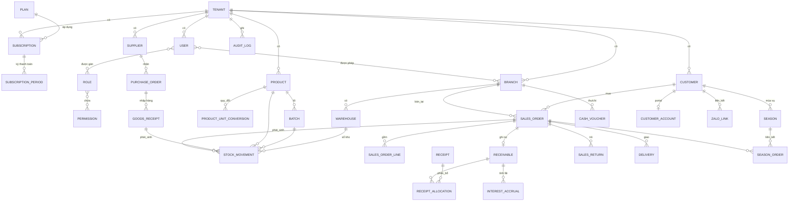

# AgriHub – ERD (mức khái niệm)

```mermaid
erDiagram
  PLAN ||--o{ SUBSCRIPTION : "áp dụng"
  TENANT ||--o{ SUBSCRIPTION : có
  SUBSCRIPTION ||--o{ SUBSCRIPTION_PERIOD : "kỳ thanh toán"
  TENANT ||--o{ BRANCH : có
  TENANT ||--o{ USER : có
  USER }o--o{ ROLE : "được gán"
  ROLE }o--o{ PERMISSION : chứa
  USER }o--o{ BRANCH : "được phép"
  TENANT ||--o{ CUSTOMER : có
  TENANT ||--o{ SUPPLIER : có
  TENANT ||--o{ PRODUCT : có
  PRODUCT ||--o{ BATCH : "lô"
  PRODUCT ||--o{ PRODUCT_UNIT_CONVERSION : quy_đổi
  BRANCH ||--o{ WAREHOUSE : có
  WAREHOUSE ||--o{ STOCK_MOVEMENT : "sổ kho"
  BATCH ||--o{ STOCK_MOVEMENT : ""
  PRODUCT ||--o{ STOCK_MOVEMENT : ""
  SUPPLIER ||--o{ PURCHASE_ORDER : nhận
  PURCHASE_ORDER ||--o{ GOODS_RECEIPT : "nhập hàng"
  GOODS_RECEIPT ||--o{ STOCK_MOVEMENT : phát_sinh
  CUSTOMER ||--o{ SALES_ORDER : mua
  BRANCH ||--o{ SALES_ORDER : bán_tại
  SALES_ORDER ||--o{ SALES_ORDER_LINE : gồm
  SALES_ORDER ||--o{ STOCK_MOVEMENT : phát_sinh
  SALES_ORDER ||--o| RECEIVABLE : "ghi nợ"
  RECEIPT ||--o{ RECEIPT_ALLOCATION : phân_bổ
  RECEIVABLE ||--o{ RECEIPT_ALLOCATION : ""
  RECEIVABLE ||--o{ INTEREST_ACCRUAL : "tính lãi"
  SALES_ORDER ||--o{ SALES_RETURN : trả
  SALES_ORDER ||--o{ DELIVERY : giao
  CUSTOMER ||--o{ SEASON : "mùa vụ"
  SEASON ||--o{ SEASON_ORDER : liên_kết
  SALES_ORDER ||--o{ SEASON_ORDER : ""
  BRANCH ||--o{ CASH_VOUCHER : "thu/chi"
  CUSTOMER ||--o| CUSTOMER_ACCOUNT : "portal"
  CUSTOMER ||--o{ ZALO_LINK : liên_kết
  TENANT ||--o{ AUDIT_LOG : ghi
```

Mức cột chi tiết sẽ được bổ sung khi thiết kế từng module (trước khi viết migration), theo DATABASE_DESIGN.md.
